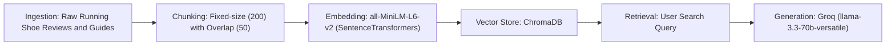

# Project 1 Planning: The Unofficial Guide

> Write this document before you write any pipeline code.
> Your spec and architecture diagram are what you'll use to direct AI tools (Claude, Copilot, etc.) to generate your implementation — the more specific they are, the more useful the generated code will be.
> Update the Retrieval Approach and Chunking Strategy sections if you change your approach during implementation.
> Update this file before starting any stretch features.

---

## Domain

<!-- What domain did you choose? Why is this knowledge valuable and hard to find through official channels? -->

The domain I chose was running shoes. This knowledge is valuable because a good pair of running shoes gives you the confidence and comfortability to perform well, whether it's recreationally or competitively. The problem that most people encounter is choosing the "right" pair of running shoes. This is because there are many factors to take into consideration: price, material, sizing, etc. Aggregating all of this data together with a RAG model can give users the best personalized choice for what running shoes to buy.

---

## Documents

<!-- List your specific sources: URLs, subreddit names, forum threads, or file descriptions.
     Aim for at least 10 sources that together cover different subtopics or perspectives within your domain. -->

| # | Source | Description | URL or location |
|---|--------|-------------|-----------------|
| 1 | Running Warehouse | A forum regarding the best running shoes to buy as of June 2026, depending on the attribute you're looking for (stability, max cushion, etc.). | https://www.runningwarehouse.com/learningcenter/gear_guides/footwear/best_running_shoes.html?from=gsearch&from=gshop&gad_source=1&gad_campaignid=12650333882&gbraid=0AAAAADka_jhmEg-nu7NFxDiE42FIF1OMo&gclid=CjwKCAjw857RBhAgEiwAI-1yKOeFY64em7jvIQ-xl6UMniLLAzjv49wGpzZZs3AA9OcFtjIMvoL0khoCT84QAvD_BwE
 |
| 2 | Runner's World | A list of the best running shoes curated by Runner's World, a renowned global magazine and website for runners. | https://www.runnersworld.com/gear/a19663621/best-running-shoes/
 |
| 3 | Reddit | A Reddit forum about the worst running shoes Redditors have ever bought. r/RunningShoeGeeks is an active running community with over 200K members. | https://www.reddit.com/r/RunningShoeGeeks/comments/16szb4e/worst_shoes_you_have_ever_bought/ |
| 4 | Reddit | A Reddit forum about the least favorite running shoes Radditors have ever bought. r/RunningShoeGeeks is an active running community with over 200K members. | https://www.reddit.com/r/RunningShoeGeeks/comments/16lwot2/what_are_your_least_favorite_running_shoes/ |
| 5 | Runrepeat | A guide on the best shoes for cross-country running, curated by Runrepeat. Runrepeat is a legitimate, highly trusted platform for athletic footwear reviews. | https://runrepeat.com/guides/best-cross-country-shoes |
| 6 | Reddit | A Reddit forum about the best shoes for cross country running. r/CrossCountry is an active running community with over 11K weekly visitors. | https://www.reddit.com/r/CrossCountry/comments/162zmd9/shoes_for_cross_country/ |
| 7 | Runrepeat | A guide on the best shoes for indoor/treadmill running, curated by Runrepeat. Runrepeat is a legitimate, highly trusted platform for athletic footwear reviews. | https://runrepeat.com/guides/best-treadmill-running-shoes |
| 8 | Reddit | A Reddit forum about the best budget running shoes. r/AdvancedRunning is an active running community with over 152K weekly visitors. | https://www.reddit.com/r/AdvancedRunning/comments/1ivvygy/for_budgetconscious_runners_what_are_the_most/ |
| 9 | Runner's World | A list of the most affordable running shoes curated by Runner's World, a renowned global magazine and website for runners. | https://www.runnersworld.com/gear/a24228881/affordable-running-shoes/ |
| 10 | Supwell | A list of the most expensive running shoes from every athletic brand, curated by Supwell. Supwell is an established digital platform designed for hobby joggers and running shoe enthusiasts. | https://www.supwell.com/supbeat/rating-the-most-expensive-race-shoes-from-every-brand |

---

## Chunking Strategy

<!-- How will you split documents into chunks?
     State your chunk size (in tokens or characters), overlap size, and explain why those
     numbers fit the structure of your documents.
     A review-heavy corpus warrants different chunking than a long FAQ. -->

**Chunk size:** 200 tokens

**Overlap:** 50 tokens

**Reasoning:** After examining all of the documents I selected, the average review always falls below 200. The only exception are the reviews posted by Runner's World, which are usually about 250-300 words (tokens). To account for this, I have set the overlap to 50 tokens. The longest review I recorded in all of the documents is 309 words, which is significantly longer than the average. Since I'd rather accurately capture 200 majority of the reviews, I have set the Chunk size to 175 tokens, which is a more reasonable measure for the other reviews.

---

## Retrieval Approach

<!-- Which embedding model are you using (e.g., all-MiniLM-L6-v2 via sentence-transformers)?
     How many chunks will you retrieve per query (top-k)?
     If you were deploying this for real users and cost wasn't a constraint, what tradeoffs
     would you weigh in choosing a different embedding model — context length, multilingual
     support, accuracy on domain-specific text, latency? -->

**Embedding model:** all-MiniLM-L6-v2

**Top-k:** Top-k of 20 (not too long but also not too short)

**Production tradeoff reflection:** If cost wasn't a constraint, would definitely opt for a more highly specialized embedding model to capture a more precise context window.

---

## Evaluation Plan

<!-- List your 5 test questions with their expected correct answers.
     Questions should be specific enough that you can judge whether the system's response
     is right or wrong. "What are good dining halls?" is too vague.
     "What do students say about wait times at [dining hall name] during lunch?" is testable. -->

| # | Question | Expected answer |
|---|----------|-----------------|
| 1 | What are the most expensive shoes offered by Nike? | Nike Alphafly 3 at $295 |
| 2 | What are the best running shoes offered by Adidas? | Adidas Adizero Evo SL |
| 3 | According to Supwell, are On Cloudboom Strike LS worth the $330 price tag? | No |
| 4 | What are the best lightweight cross-country shoes according to Runrepeat? | Nike Zoom Victory Waffle 5 |
| 5 | What are the best daily trainers for stability, according to Running Warehouse? | Brooks Adrenaline GTS 25 |

---

## Anticipated Challenges

<!-- What could go wrong? Name at least two specific risks with reasoning.
     Consider: noisy or inconsistent documents, missing source attribution, off-topic
     retrieval, chunks that split key information across boundaries. -->

1. Differing opinions can give the LLM a hard time deciding what "best" entails. I tried to avoid this by finding sources that ranked shoes by their "best attribute" (best cushioning, best durability, best stability, etc.)

2. Since Reddit forums contain small responses, and online guides contain larger responses, there may be issues with retrieving valid chunks for the LLM to use, which will result in poor evaluation.

---

## Architecture

<!-- Draw a diagram of your pipeline showing the five stages:
     Document Ingestion → Chunking → Embedding + Vector Store → Retrieval → Generation
     Label each stage with the tool or library you're using.
     You can use ASCII art, a Mermaid diagram, or embed a sketch as an image.
     You'll use this diagram as context when prompting AI tools to implement each stage. -->

---

## AI Tool Plan

<!-- For each part of the pipeline below, describe:
     - Which AI tool you plan to use (Claude, Copilot, ChatGPT, etc.)
     - What you'll give it as input (which sections of this planning.md, which requirements)
     - What you expect it to produce
     - How you'll verify the output matches your spec

     "I'll use AI to help me code" is not a plan.
     "I'll give Claude my Chunking Strategy section and ask it to implement chunk_text()
     with my specified chunk size and overlap" is a plan. -->

**Milestone 3 — Ingestion and chunking:** I'll give Claude my Documents and Chunking Strategy sections and ask it to implement ingest.py and chunk_text.py with my specified chunk size and overlap, using the specified documents for ingestion

**Milestone 4 — Embedding and retrieval:** I'll give Claude my Retrieval Approach section and ask it to implement retriever.py using the specified embedding model and Top-k

**Milestone 5 — Generation and interface:** I'll give Claude code my Architecture section and ask to implement generator.py and app.py using the specified RAG workflow from the mermaid diagram
